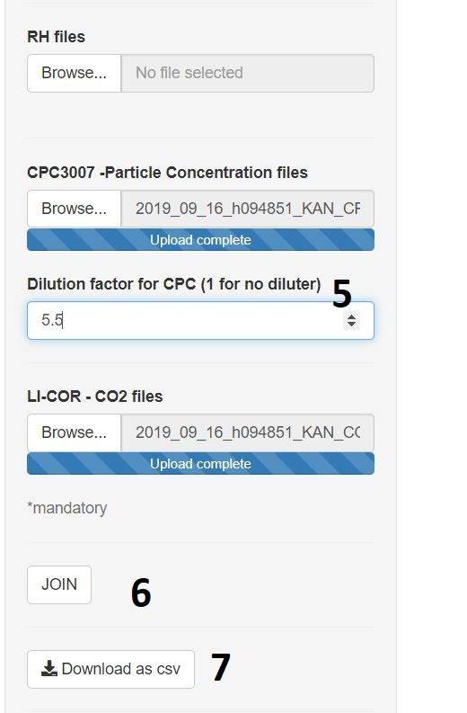
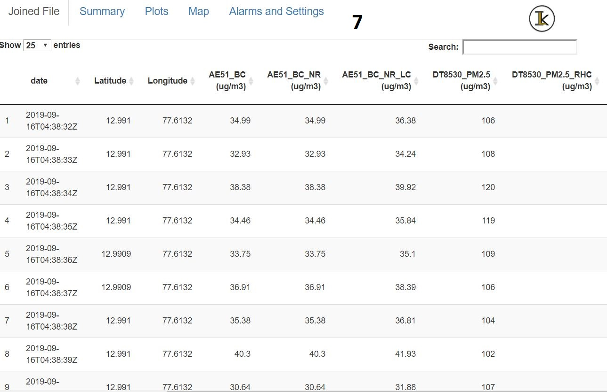
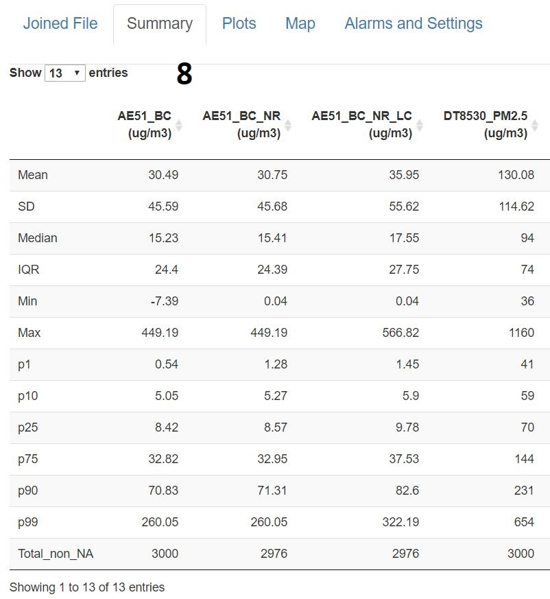
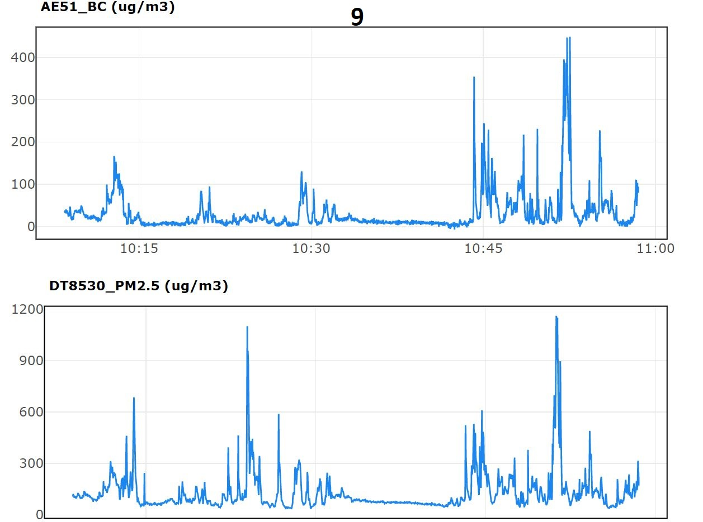
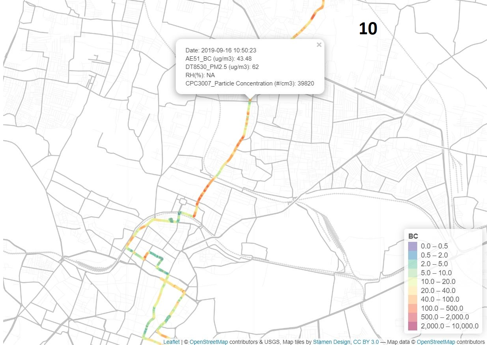
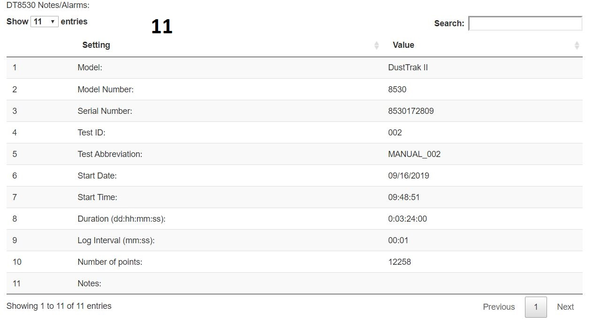

# mmaqshiny v1.0: R-Shiny package to explore air quality mobile monitoring data 

## Summary

The R-Shiny package `mmaqshiny` is for analysing, visualising and spatial plotting of high-resolution air quality data collected by specific devices installed on a moving platform.  With the click of a button, the app generates: summary statistics, time series plots and spatial map of pollutant concentrations. This app reduces the time consumed for analysing each pollutant individually. It helps check the quality of the data at near real time (same day) and instantly visualise pollution hotspots. The time series plots of each pollutant help in understanding the temporal patterns of concentrations and performance of the instruments. 

High frequency (1 Hz) data of PM<sub>2.5</sub> (mass concentrations of particulate matter with size less than 2.5 microns), Black carbon mass concentrations (BC), ultra-fine particle number concentrations, carbon-di-oxide (CO<sub>2</sub>) along with GPS coordinates and relative humidity (RH) data are collected by some popular portable instruments (TSI DustTrak-8530, Aethlabs microAeth-AE51, TSI CPC3007, LICOR Li-850, Garmin GPSMAP 64s, Omega USB RH probe respectively) can be handled by this package. The package incorporates device specific cleaning and correction algorithms. RH correction is applied to DustTrak PM<sub>2.5</sub> following a method described in @Chakrabarti:2004. If required, user can also input linear regression coefficients for correcting the PM<sub>2.5</sub> data.
An example of DustTrak PM<sub>2.5</sub> raw and corrected data, using slope=0.21, intercept=11.1 is shown below.

|  | 
|:--:| 
| *Uncorrected* `DT8530_PM2.5` |


|  | 
|:--:| 
| *Corrected* `DT8530_PM2.5_Ref` |

The package cleans BC data for the vibration generated noise, by adopting a statistical procedure as explained in @Apte:2011, followed by a loading correction as suggested by @Ban-Weiss:2009. For the ultra-fine particle number concentration data, provision is given for dilution correction factor (if a diluter is used with CPC3007; default value is 1). 


The package joins the raw, cleaned and corrected data from the above mentioned instruments and generates a downloadable csv file. It accepts multiple files for each parameter. The input files should have a date prefix of the format `yyyy_mm_dd` in their file names. The package can process multiple files for a given date at a time and the file name prefix is used to perform the check. An error message will be generated if the prefix is not matched between various pollutant filenames.


The package requires GPS file (.gpx) as a mandatory input along with timezone (a link to all accepted timezone formats in R is also included). All other pollutant files are optional. A testing data set is provided in the "data" folder inside inst/shiny; with each instrument folder containing 2 days of data.


The example data included [here](https://github.com/meenakshi-kushwaha/mmaqshiny/tree/master/inst/shiny/data) contains with following file names - 

- xxx_Garmin correspond to Garmin GPS location files
- xxx_AE51 correspond to AE51 BC files
- xxx_DT8530 correspond to DustTrak 8530 PM<sub>2.5</sub> files
- xxx_RH correspond to RH files
- xxx_CPC3007 correspond to CPC3007 Particle Concentration files
- xxx_LI_COR correspond to LI-COR CO<sub>2</sub> files


The output is displayed in five different tabs.

1) `Joined File` displays all cleaned and joined data 
2) `Summary` displays summary statistics for each parameter,
3)  `Plots` displays interactive  time series line plots for raw parameters. 
4) `Map` provides a spatial map for the user selected pollutant on an OpenStreetMap background. 
5) `Alarm and Settings` tab displays each instrument's settings and alarms (if any).


## Limitations

1) handles single day data at a time
2) provision for only linear correction coefficients of PM<sub>2.5</sub>
3) instrument specific 
4) file renaming (with date prefix) is required


## Installation

`mmaqshiny` can be installed from [github](https://github.com/).

Load and run `mmaqshiny` as follows:

``` r
devtools::install_github("meenakshi-kushwaha/mmaqshiny")
library(mmaqshiny)
mmaqshiny::mmaqshiny_run()
```
A preloaded dataset appears which is a joined file of sample data collected during a mobile monitoring campaign in Bangalore, India.

## User Guide

To use the app, follow the steps below.

1. User needs to add the timezone of data collection. 

2. Add .gpx files from GPSMAP64s (location data). NOTE: A warning message will appear if input files are from different dates. 

3. Add pollutant .csv files as downloaded from the instruments.

4. User can add slope and intercept if a linear correction is required for the DustTrak measured PM<sub>2.5</sub>. 


5. User can also input a Dilution factor if diluter is used for CPC-3007. Default value is 1 (no diluter).

6. Click join button. 

7. Click the download button to download the joined csv file.





8. Summary tab allows user to check the summary statistics for each of the pollutant. 



9. The Plots tab displays time series plots of all the raw (uncorrected) location and pollutant parameters. 



10. The Map tab visualises interactive maps for spatial visualization of selected pollutant.




11. Alarms and Settings tab display any status errors during data collection and instrument setting. 




## Glossary
- `Latitude`:Latitude
- `Longitude`: Longitude
- `AE51_BC`: Raw BC data 
- `AE51_BC_NR`: Noise removed BC 
- `AE51_BC_NR_LC`: Noise removed and loading corrected BC
- `DT8530_PM2.5`: Raw PM2.5
- `DT8530_PM2.5_RHC`: RH corrected PM2.5
- `DT8530_PM2.5_RHC_Ref`: Reference and RH corrected PM2.5
- `DT8530_PM2.5_Ref`: Reference corrected PM2.5
- `CPC3007_Particle Concentration`: Dilution corrected ultra-fine particle number concentration
- `Li-COR_CO2`: CO<sub>2</sub> data


## Community guidelines

1. Contribute to the software

- Please open an issue in the issue tracker of the project that describes the changes you would like to make to the software and open a pull request with the changes.

2. Report issues or problems with the software / Seek Support

- Please open an issue in the [issue tracker of the project.](https://github.com/meenakshi-kushwaha/mmaqshiny/issues)


## Instrument Description


1. DustTrak 8530

It utilises the well-established aerosol light scattering technique to estimate the real-time aerosol mass loadings and works at a flow rate of 3 LPM (liters per minute). Detailed specifications can be [found here.](https://tsi.com/products/aerosol-and-dust-monitors/dust-monitors/dusttrak-ii-aerosol-monitor-8530/)


2. microAeth AE51

It is a highly sensitive, palm-held and battery-operated instrument designed for measuring the optically-absorbing BC component of aerosol particles.It measures the rate of change in absorption of transmitted light (880 nm) due to continuous collection of aerosols load on to the filter ticket and has a wide dynamic range of measurement from 0 to 1 mg/m³. More details of AE51 can be [found here.]( https://aethlabs.com/microaeth/ae51/overview)

3. Condensation Particle Counter 3007 (CPC)

It is an alcohol based handheld instrument used to measure ultrafine particles. It works on the optical detection principle, and operates at a flow rate of 0.7 LPM.The instrument detects and measures the particles in the size range of 10 nm to > 1 µm.  More technical details of the instrument can be [found here.](https://www.tsi.com/condensation-particle-counter-3007/)

4. LI-COR 850

It is a CO<sub>2</sub>/H<sub>2</sub>O gas analyzer which has a measurement range of 0-20,000 ppm and accuracy of 1.5%. For logging the data it requires a laptop with the software called LI-COR. More details can be [found here.]( https://www.licor.com/env/products/gas_analysis/LI-830_LI-850/)

5. Omega RH-USB

It is an instrument used for measuring RH and temperature. It has an accuracy of ±3% for Relative humidity and  ±1°C (±1.8°F) for temperature. It requires a software to log the data called TRH central. The frequency of data logging can be changed as per need using this software. For more [information click here.]( https://www.omega.com/en-us/calibration-equipment/handheld-calibrator/p/RH-USB-Series)

6. GPSMAP-64s

It works on the ‘trilateration’ mathematical principle of GPS and usually connects to 4 satellites to give the accurate location. More technical details of the instrument can be [found here.]( https://www.garmin.co.in/products/outdoor/gpsmap64s-sea/)


